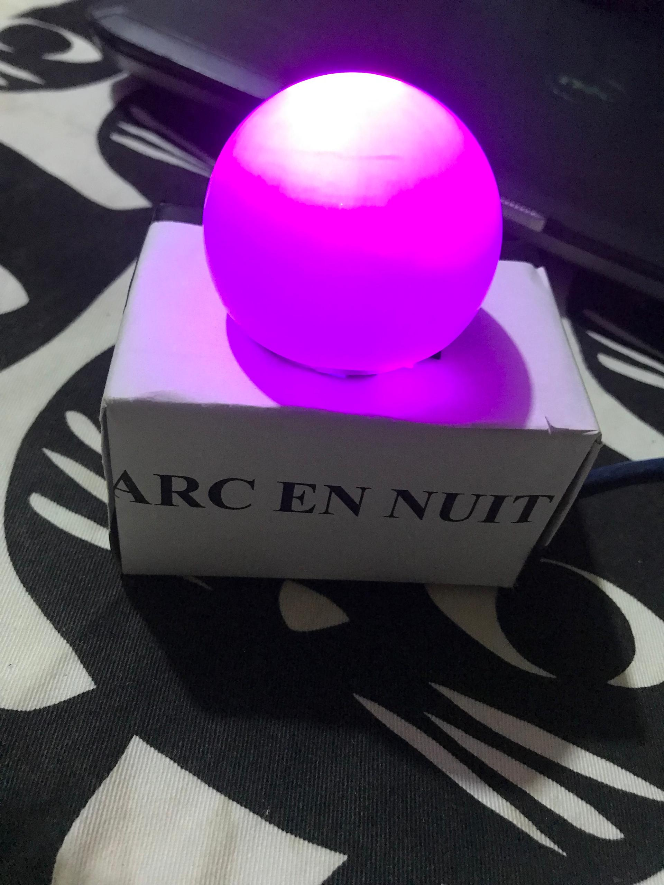

# 🌈 ARC EN NUIT : Veilleuse Intelligente Automatisée



## 💡 Introduction et Concepteur

Ce projet a été pensé, conçu et développé par :
* **Max_Adis** (Ingénieur en systèmes embarqués et domotique)

**ARC EN NUIT** est une solution domotique professionnelle de gestion d'éclairage ambiant. Il s'agit d'une veilleuse intelligente capable de s'adapter automatiquement à la luminosité de la pièce. Dès que l'obscurité est détectée, le système s'active et génère un balayage fluide et esthétique de toutes les couleurs de l'arc-en-ciel. À l'inverse, la détection d'une lumière vive déclenche l'extinction automatique du système pour optimiser la consommation énergétique.

***

## 🛠️ Matériel Utilisé 

Cette section liste les composants matériels essentiels à la conception du circuit d'éclairage adaptatif.

| Composant | Quantité | Rôle dans le Projet |
| :--- | :---: | :--- |
| **Microcontrôleur** (Arduino UNO) | 1 | Cœur du système, traitement des données analogiques et génération des signaux PWM. |
| **Capteur de Luminosité (LDR)** | 1 | Détection en temps réel du niveau d'éclairage ambiant. |
| **LED RGB** | 1 | Actionneur principal : affichage du balayage chromatique (Arc-en-ciel). |
| **LED Rouge** | 1 | Actionneur secondaire : utilisé exclusivement pour la phase initiale de test et de calibration du capteur. |
| **Résistance 10 kΩ** | 1 | Configuration en pont diviseur de tension (pull-up/pull-down) pour la lecture du capteur LDR. |
| **Résistance 220 Ω** | 1 | Limitation du courant pour la protection de la LED. |
| **Câbles de Connexion (Jumpers)** | Lot | Interconnexion des différents composants sur la platine d'essai. |

***

## 🔌 Schéma Électronique

Le schéma ci-dessous détaille le câblage complet du système, illustrant le pont diviseur pour l'entrée analogique et les sorties PWM pour le contrôle colorimétrique.


***

## 🖼️ Phases Clés de la Conception et Tests

Ces visuels illustrent les étapes évolutives de notre processus de conception, de la calibration initiale au rendu final.

### Tests des Périphériques et Intégration

* **Phase 1 : Calibration et Test du Capteur LDR**
  Montage initial utilisant une LED rouge simple pour valider le seuil de basculement jour/nuit du capteur.
  

* **Phase 2 : Intégration RGB et Balayage Chromatique**
  Remplacement de la LED de test par le module RGB et implémentation des signaux PWM pour créer l'effet arc-en-ciel.
  

***

## 💻 Code Source

Le code source du projet gère la lecture analogique et les transitions PWM. 

### Aperçu des Fonctionnalités Clés

| Fonction | Rôle |
| :--- | :--- |
| `analogRead(ldrPin)` | Récupère la valeur de tension brute du pont diviseur LDR pour évaluer la luminosité. |
| `balayageArcEnCiel` | Génère une transition douce entre les couleurs primaires via une boucle d'incrémentation PWM. |
| `eteindreLED` | Coupe immédiatement l'alimentation des broches RGB lorsque le seuil de lumière vive est atteint. |

### Programme Principal (C++)

```cpp
// --- ARC EN NUIT : Veilleuse Intelligente ---
// Concepteur : Max_Adis

const int ldrPin = A0;      
const int redPin = 9;       
const int greenPin = 10;    
const int bluePin = 11;     

int ldrValue = 0;
const int seuilNuit = 400;  // Seuil de déclenchement (à calibrer)
const int delayTime = 20;   // Vitesse du balayage

void setup() {
  pinMode(redPin, OUTPUT);
  pinMode(greenPin, OUTPUT);
  pinMode(bluePin, OUTPUT);
  Serial.begin(9600);
}

void loop() {
  ldrValue = analogRead(ldrPin);
  Serial.print("Luminosité : ");
  Serial.println(ldrValue);

  if (ldrValue < seuilNuit) {
    balayageArcEnCiel();
  } else {
    eteindreLED();
  }
}

void eteindreLED() {
  analogWrite(redPin, 0);
  analogWrite(greenPin, 0);
  analogWrite(bluePin, 0);
}

void balayageArcEnCiel() {
  for (int i = 0; i < 255; i++) {
    analogWrite(redPin, 255 - i);
    analogWrite(greenPin, i);
    analogWrite(bluePin, 0);
    delay(delayTime);
    if(analogRead(ldrPin) >= seuilNuit) return; 
  }
  for (int i = 0; i < 255; i++) {
    analogWrite(redPin, 0);
    analogWrite(greenPin, 255 - i);
    analogWrite(bluePin, i);
    delay(delayTime);
    if(analogRead(ldrPin) >= seuilNuit) return;
  }
  for (int i = 0; i < 255; i++) {
    analogWrite(redPin, i);
    analogWrite(greenPin, 0);
    analogWrite(bluePin, 255 - i);
    delay(delayTime);
    if(analogRead(ldrPin) >= seuilNuit) return;
  }
}
